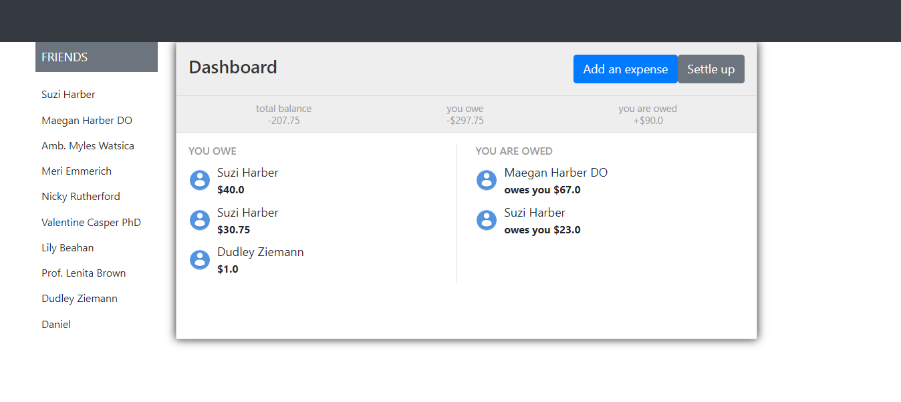

# Split App

> The app allows one to make and keep track of expenses between friends. An expense can be split evenly or by specific amounts. Or there can be no splits at all - it can be a solo purchase. 

## Built With

- Ruby on Rails
- Javascript
- Bootstrap

## Live Demo

[Live Demo Link](http://split-wise-app.herokuapp.com/)

## Getting Started

**Here are steps for setting up this app**

To get a local copy up and running follow these simple example steps.

### Prerequisites

- Ruby
- Ruby on Rails
- PostgreSQL
- Yarn

### Setup

- In your local PC, open your terminal in the folder you would like to clone the project to
- Copy the link to this repository from the green `Code` button
- In the terminal run  `git clone https://github.com/TedLivist/split-app.git`
- Change into the directory of the cloned app: `cd split-app`

### Install

- Run `bundle install` to install the ruby gems
- Run `yarn install` to install dependencies

### Usage

- Run `rails db:create` to create the database tables
- Run `rails db:migrate` run the migration files
- Run `rails db:seed` to create pre-defined users
- Run `rails s` to spin up a development server
- Once the server is up and running, in your browser visit `http://localhost:3000` to view the app

### Run tests

- Run `rspec spec` on the terminal to run the tests
OR
- Run  `bundle exec rspec spec` if you have terminal related issues with the aforementioned command

## Authors

👤 **Teddy-Livingstone**

- [GitHub](https://github.com/TedLivist)
- [LinkedIn](https://linkedin.com/in/tememandu)

## 🤝 Contributing

Contributions, issues, and feature requests are welcome!

Feel free to check the [issues page](../../issues/).

## Show your support

Give a ⭐️ if you like this project!

## Acknowledgments

- Inspiration
- Perseverance
- etc

## 📝 License

This project is [MIT](./MIT.md) licensed.